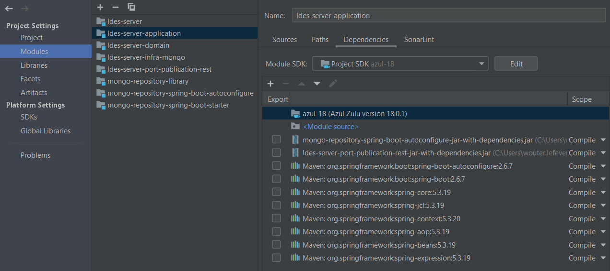

# LDES Server

## About

The LDES Server is a configurable component that can be used to ingest, store, transform and (re-)publish an LDES.

## How to use the LDES Server
We'll show you how to set up your own LDES Server both locally and via Docker using a mongo db for storage and a rest endpoint for ingestion and publication.
Afterwards, you can change storage, ingestion and publication options by plugging in other components.

### Locally

#### Docker-compose

There are 3 files where you can configure the dockerized application:
- [The .env file](#docker-compose-config-env)
- [The config files](#docker-compose-config-config)
- [The docker-compose file](#docker-compose-config-yml)

##### <a name="docker-compose-config-env"></a>The .env file

The [.env](.env) file allows you to configure the repository for the LDES bom (e.g. if you've forked the VSDS repo and want to test changes) and change the port the application will run on (in case you already have services running on the default port 8080).

```bash
# The LDES BOM repository
DOCKER_LDES_BOM_REPO=https://github.com/Informatievlaanderen/VSDS-LDES.git
```

##### <a name="docker-compose-config-config"></a>The config files: [config.env](docker-compose/config.env) or [config.local.env](docker-compose/config.local.env)

Runtime settings can be defined in the configuration files. Use [config.env](docker-compose/config.env) for a public setup and be sure not to commit this file, as it contains secrets. For a local setup, use [config.local.env](docker-compose/config.local.env). It's safe to commit this file with secrets, since they'll only be relevant to your local environment (assuming you don't reuse personal passwords for public services for your local services).

##### <a name="docker-compose-config-yml"></a> The docker-compose file: [docker-compose.yml](docker-compose.yml)

Change the `env_file` to `config.env` or `config.local.env` according to your needs.

##### Starting the dockerized application

Run the following commands to start the containers:

```bash
COMPOSE_DOCKER_CLI_BUILD=1 docker-compose build
docker-compose up
```

The server application will be available on the port you configured with `DOCKER_LDES_SERVER_PORT` (or port 8080 by default).

#### IntelliJ

To start an LDES Server locally in your IntelliJ IDE, you'll need to add components for storage, ingestion and publication to your classpath.
In IntelliJ you can do this by updating your project structure.
Go to the `ldes-server-application` module and add jars for storage and publication.
Your project structure will look as follows: 

Now you only need to provide the correct environment variables by overriding the placeholders in [application.yml](ldes-server-application/src/main/resources/application.yml).

And you can spin up your own LDES Server.